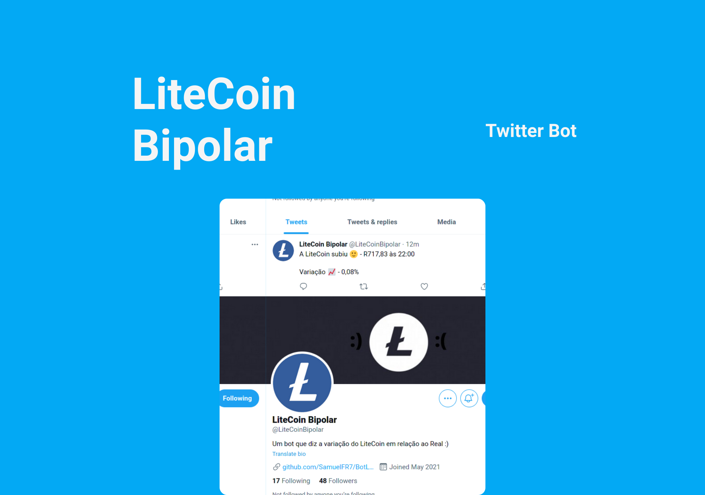

<h1 align="center">
    <a href="https://twitter.com/LiteCoinBipolar">
    
    </a>
</h1>

<p align="center">
  <a href="/LICENSE">
        
  </a> 
</p>

<br>

## 🧪 Tecnologias

O projeto foi desenvolvido usando as seguintes tecnologias: 

- [Node](https://nodejs.org)
- [Mongo](https://www.mongodb.com/)
- [TypeScript](https://www.typescriptlang.org/)

## 🚀 Como executar
Requisitos: 
- [Node](https://nodejs.org)
- [MongoDB](https://www.mongodb.com/)

Crie uma conta de desenvolvedor no Twitter, e adicione as chaves de uso.

Clone o projeto e acesse a pasta dele.

```bash
$ git clone https://github.com/SamuelFR7/BotLTC.git
$ cd BotLTC
```

Para iniciá-lo, siga os passos abaixo:
```bash
# Instalar as dependencias:
$ yarn

#Iniciar o projeto
$ yarn dev
```
O bot começará a rodar em sua máquina.

## 💻 Projeto

Esse projeto é apenas uma aplicação de conceitos estudados.

## 📝 License

Esse projeto está sob a licença MIT. Veja o arquivo [LICENSE](LICENSE) para mais detalhes.

---

Feito por Samuel Rezende [Linkedin](https://www.linkedin.com/in/samuel-ferreira-rezende-7bbbba206/)
